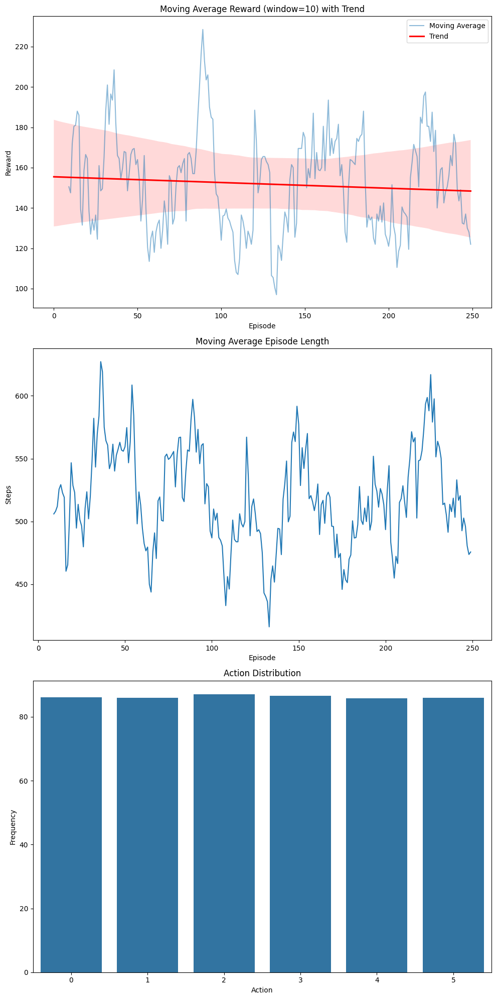
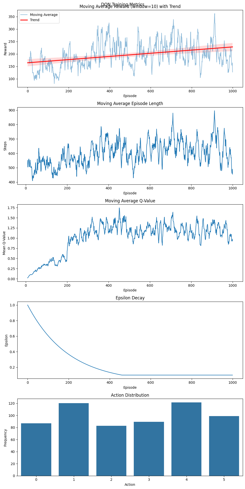
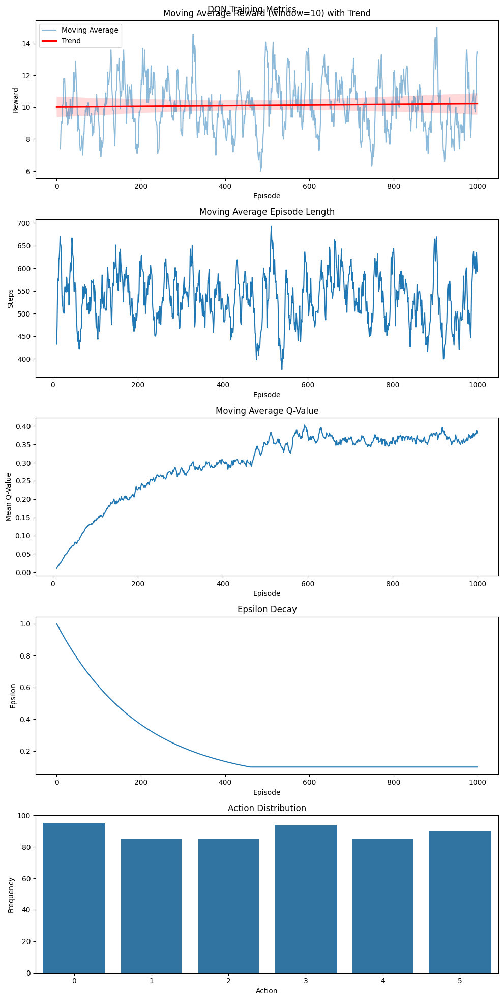
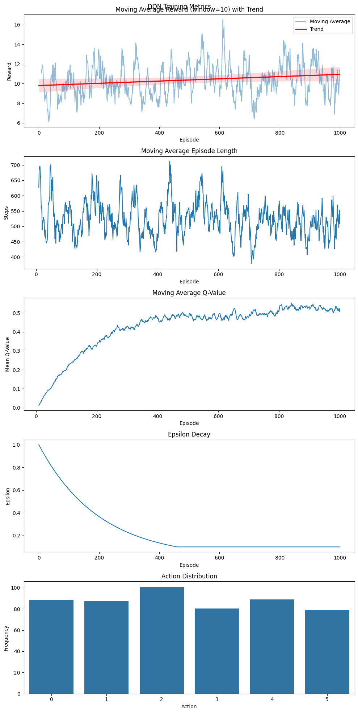
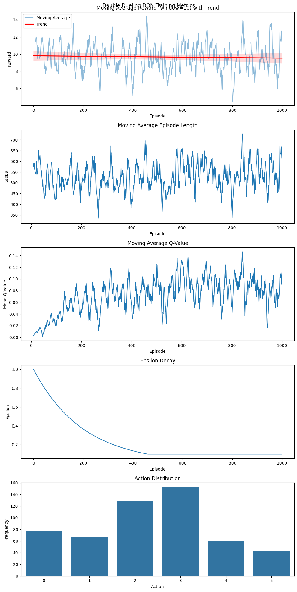
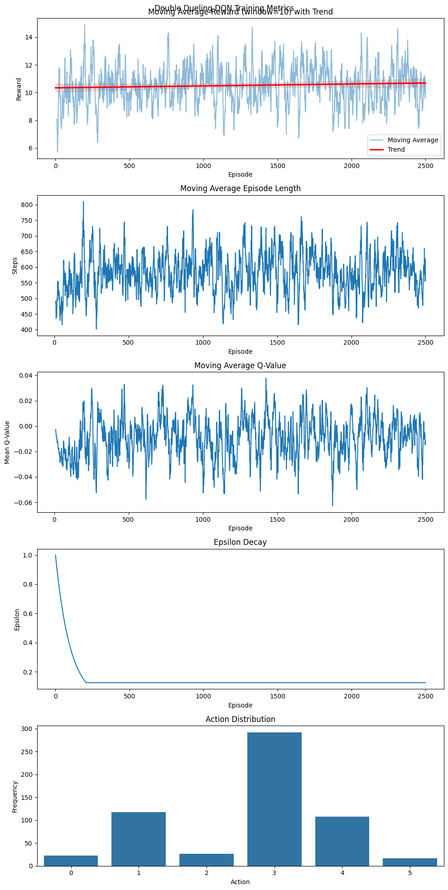

# Deep Reinforcement Learning für Atari Space Invaders

## 1. Baseline-Definition und Bewertung

Die Baseline-Implementierung bestand aus einem Random Agenten, der die Space-Invaders Umgebung spielte. Dies lieferte erste Vergleichswerte:

- Durchschnittliche Belohnung: 151,92
- Durchschnittliche Episodenlänge: 517,54 Schritte
- Keine konsistente Strategie (zufällige Aktionsauswahl)

Die Baseline-Bewertung lief über 250 Episoden und zeigte eine stark variable Leistung, was bei zufälligen Aktionen zu erwarten ist. Die Kennzahlen zeigten:

```
Min reward: 5.0
Max reward: 640.0
Median reward: 130.0
```



## 2. Erste Ansätze

Die erste Implementierung verwendete ein einfaches DQN (Deep Q-Network) mit folgenden Hauptkomponenten:

- Convolutional Neural Network zur Verarbeitung der Spielbilder
- Experience Replay Buffer
- ε-greedy Explorationsstrategie (beginnend bei 1,0, abnehmend bis 0,1)
- Target Network für stabiles Lernen
- Lernrate: 0,0001
- Batch-Größe: 32
- Gamma (Diskontierungsfaktor): 0,99

Die Architektur bestand aus:
- 3 Faltungsschichten mit ReLU-Aktivierungen
- 2 vollständig verbundenen Schichten
- Ausgabeschicht entsprechend dem Aktionsraum

Der initiale Trainingslauf zeigte folgende Ergebnisse:
- Ein leichter Aufwärtstrend in der Trainingskurve, noch sehr verrauscht
- Durchschnittliche Belohnung um 200 (nicht beschnitten)
- Hohe Volatilität in Q-Werte
- Kein dominantes Aktionsauswahlmuster



## 3. Experimenteller Aufbau

Umgebungskonfiguration:
- Frame Skip: 4 Frames
- Frame Stacking: 4 Frames
- Graustufen-Konvertierung und Größenanpassung auf 84x84
- Belohnungsbegrenzung auf [-1, 1]
- Episodenbeendigung bei Lebensverlust
- 1000 Trainingsepisoden pro Variante
- Auswertung alle 100 Episoden (jeweils 10 Episoden)

Aktionsraum: 6 Aktionen (0-5)
- 0: Keine Aktion
- 1: Schießen
- 2: Rechts
- 3: Links
- 4: Rechts-Schießen
- 5: Links-Schießen

## 4. Verbesserungen und Auswertungen

### 4.1 Umgebungsänderungen
Ich begann mit der Standard Space-Invaders Umgebung und einer Vorverarbeitungsfunktion zur Größenanpassung und Graustufen-Konvertierung. Als Verbesserung implementierte ich folgende Änderungen:

- **Reward clipping**: Implementierung reward clipping auf [-1, 1] (Positiven rewards auf 1, negative auf -1, 0 bleibt unverändert)
  - Stabilisierte das Lernen durch Verhinderung großer Belohnungsvariationen
  - Standardpraxis in DQN-Literatur
  - Erklärt die scheinbar niedrigeren numerischen Belohnungen in Verbesserungen
- **Frame Stacking**: Verwendung von 4 Frames als Zustand
- **Frame Skipping**: Implementierung von 4-Frame-Skip

Beobachtungen aus den Ergebnissen:
- Belohnungsbegrenzung stabilisierte die Q-Wert-Schätzungen
- Durchschnittliche Belohnung um 10
- Noch kein klarer Verbesserungstrend in der Trainingskurve oder Konvergenz der Aktionsauswahl




### 4.2 Replay Buffer Warmup
- Hinzufügung von 5000-10000 zufälligen Übergängen vor dem Training
- Ziel war die Vermeidung von Überanpassung an frühe Erfahrungen
- Beobachtungen aus den Ergebnissen:
  - Q-Werte zeigten gleichmäßigere Progression
  - Durchschnittliche Belohnung um 9-10
  - Episodenlängen blieben konstant bei etwa 500-600 Schritten

Insgesamt schien das Hinzufügen eines Warmups zum Replay Buffer den Lernprozess zu verbessern, mit einem deutlicheren Aufwärtstrend in den Belohnungen, während es immer noch recht flach blieb.



### 4.3 Double DQN
- Implementiert zur Reduzierung des Überschätzungs-Bias
- Beobachtungen aus den Ergebnissen:
  - Durchschnittliche Belohnung ~11,1
  - Q-Werte zeigten hohe Volatilität (Bereich 0,0-0,5)
  - Aktionsverteilung blieb relativ gleichmäßig
  - Trainingskurve zeigte keinen klaren Verbesserungstrend
  - Episodenlängen ähnlich zur Basisimplementierung


### 4.4 Dueling DQN
- Aufteilung des Netzwerks in Wert- und Advantage streams
- Beobachtungen aus den Ergebnissen:
  - Durchschnittliche Belohnung ~9,95
  - Höhere Q-Wert-Schätzungen (0,8-1,4)
  - Vielfältigere Aktionsverteilung
  - Trainingskurve zeigte leichten Aufwärtstrend
  - Konsistentere Episodenlängen


### 4.5 Kombiniertes Double Dueling DQN
- Vereinigung beider Ansätze
- Beobachtungen aus den Ergebnissen:
  - Durchschnittliche Belohnung ~9,67
  - Niedrigere, stabilere Q-Wert-Schätzungen (Bereich 0,02-0,14)
  - Am stärksten verzerrte Aktionsverteilung
  - Flache Trainingskurve
  - Variable Episodenlängen (350-700 Schritte)



## 5. Analyse des erweiterten Trainingslaufs

Aus der Literatur und den bisherigen Ergebnissen weiß ich, dass DQN-Algorithmen extrem lange Trainingszeiten benötigen, um ihr volles Potenzial zu zeigen. Daher beschloss ich, eine erweiterte Trainingssitzung von 2500 Episoden durchzuführen, um zu sehen, ob die Verbesserungen deutlicher werden würden.

Beobachtungen aus dem erweiterten Lauf:
- **Belohnungsstabilität**: Der gleitende Durchschnitt der Belohnung blieb konstant bei etwa 10, mit sehr leichtem Aufwärtstrend
- **Episodenlänge**: Durchschnittliche Episodenlänge zeigte hohe Variabilität zwischen 450-750 Schritten, ohne klaren Verbesserungstrend
- **Q-Wert-Schätzungen**: 
  - Überraschend niedrige Q-Wert-Schätzungen (Bereich -0,06 bis 0,04)
  - Hohe Volatilität während des gesamten Trainings
  - Keine klare Stabilisierung auch bei erweitertem Training
- **Aktionsverteilung**:
  - Starke Präferenz für Aktion 3, deutet auf Konvergenz der Policy hin
  - Minimale Nutzung der Aktionen 0, 2 und 5
  - Stärker verzerrte Verteilung im Vergleich zu kürzeren Läufen
- **Exploration**: Epsilon-Abnahme erreichte Minimalwert (0,125) um Episode 400 und behielt diesen bei



Das erweiterte Training zeigt, dass:
1. Selbst mit 2,5-mal mehr Episoden der Agent Schwierigkeiten hat, signifikante Verbesserungen zu zeigen
2. Die theoretischen Vorteile des Double Dueling DQN nicht vollständig realisiert werden
3. Policy-Konvergenz in der Aktionsauswahl erkennbar ist, aber nicht unbedingt optimal, wahrscheinlich aufgrund der kurzen Explorationsphase
4. Die Umgebung möglicherweise noch längeres Training oder weitere Hyperparameter-Optimierung benötigt

## 6. Abschließender Vergleich

Aufgrund der Belohnungsbegrenzung ist ein direkter Vergleich der Rohwerte mit der Baseline nicht sinnvoll. Alle verbesserten Implementierungen erreichten ähnliche begrenzte Belohnungen (Bereich 9-11). Die hauptsächlichen Unterschiede lagen in:

- Q-Wert-Stabilität
- Aktionsauswahlmuster
- Konsistenz der Episodenlänge

Sowohl in den begrenzten 1000-Episoden als auch in den erweiterten 2500-Episoden Trainingsläufen:
- Zeigte keine Implementierung klare Überlegenheit
- Wurden theoretische Vorteile der Verbesserungen nicht vollständig realisiert
- Blieben Lernkurven relativ flach
- Behielten alle Varianten ähnliche Leistungsniveaus

Dies stimmt stark mit der DQN-Literatur überein, die nahelegt, dass diese Algorithmen Millionen von Frames benötigen, um ihr volles Potenzial zu zeigen. Selbst 2500 Episoden scheinen, trotz einiger Anzeichen von Policy-Konvergenz, unzureichend für bedeutende Leistungsverbesserungen.

## 7. Schlussfolgerungen

- Die Implementierungen zeigten fortschreitende Verbesserungen in der Lernstabilität
- Begrenzte Trainingsdauer hatte signifikanten Einfluss auf die finale Leistung
- Double und Dueling Architekturen zeigten Potenzial in der Lerneffizienz
- Erweitertes Training (2500 Episoden) zeigte Policy-Konvergenz aber begrenzte Verbesserung
- Trainingsdauer bleibt kritischer Faktor für DQN-Leistung

## 8. Zukünftige Arbeit

Potenzielle Verbesserungen:
- Deutlich längere Trainingsdauer (Millionen von Frames wie in der Literatur vorgeschlagen)
- Weitere Hyperparameter-Optimierung
- Implementierung von priorisiertem Experience Replay
- Alternative Explorationsstrategien
- Frame-Verarbeitungsoptimierung
- Fortgeschrittene Architekturen (A3C, PPO)
- Bessere Belohnungsgestaltung
- Umgebungsparameter-Abstimmung

Die hauptsächlichen Einschränkungen waren Rechenressourcen und Trainingszeit. Der erweiterte Lauf bestätigt, dass deutlich längere Trainingsperioden wahrscheinlich notwendig sind für bedeutende Leistungsverbesserungen in komplexen Umgebungen wie Space Invaders.